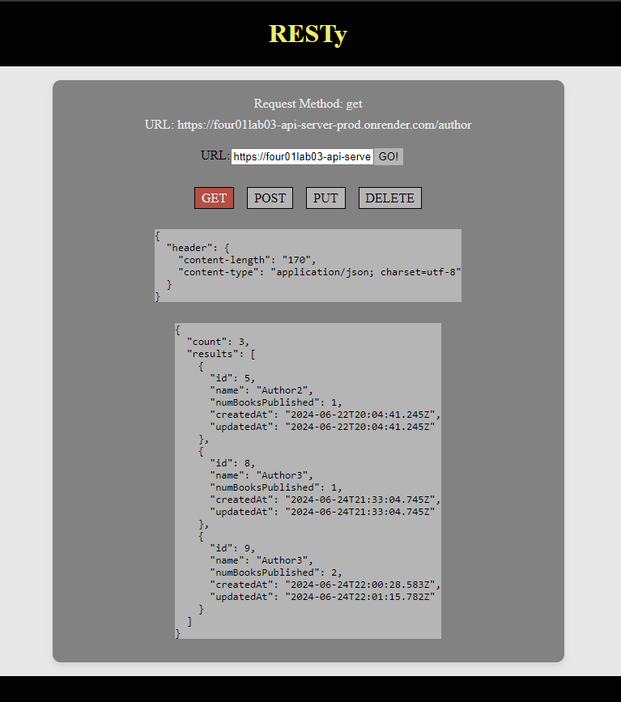
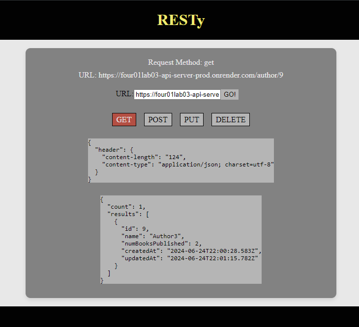
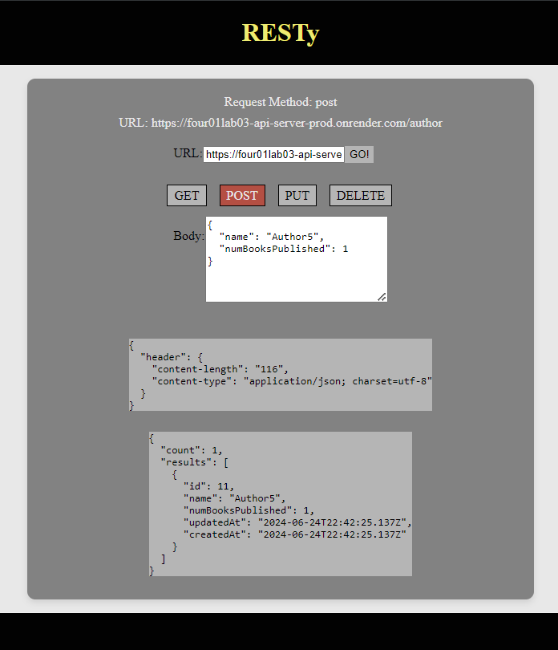
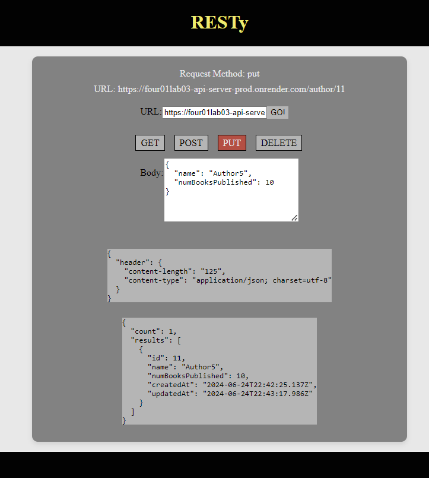
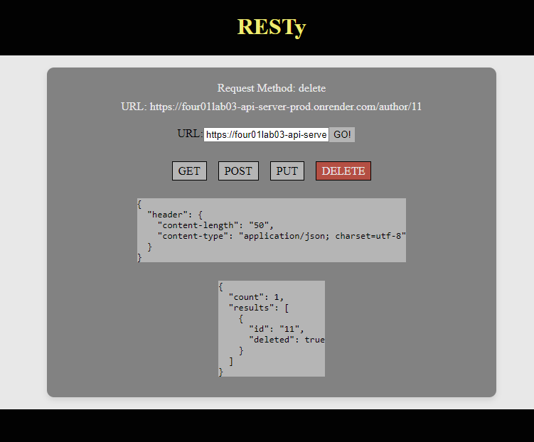
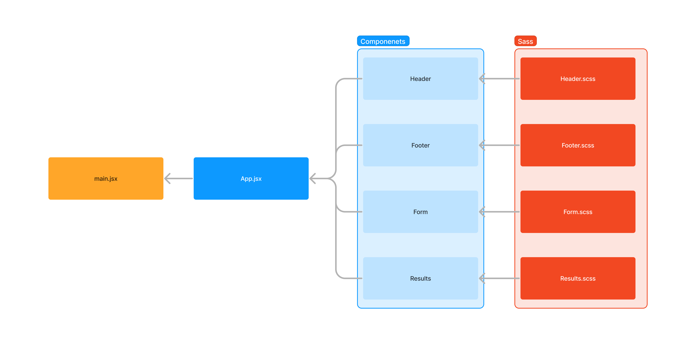

# 401 - Lab 27 - useState() Hook

## Project: RESTy

### Author: Melo

### Problem Domain

In phase 2, recieve user input in preparation of connecting to live APIs, using the useState() hook in our functional components. In order to properly manage state with the useState hook, we will now convert \<App /> to a functional component.

### Feature Tasks & Requirements

The following user stories detail the major functionality for this phase of the project.

* As a user, I want to enter the REST Method and URL to an API.
* As a user, I want to see a summary of my request as well as results returned from an API request in my browser in a readable format.

Application Flow:

* User enters an API URL.
* Chooses a REST Method.
* Clicks the “Go” button.
* Application fetches data from the URL given, with the method specified.
* Displays the response headers and results separately.
* Both headers and results should be “pretty printed” JSON.

### Technical Requirements/Note  

1. Refactor any components using this.setState() to implement the useState() react API hook.
2. Refactor the Form Component to implement user input from form elements, instead of hard coded string values.

### Componenet Hierarchy and Application Architecture

* index.js - Entry Point.

* \<App /> - Container.

        * Holds application state: The Request (from the form) and the Response (from the API).
        * Hook that can update state.
        * Renders 2 Child Components.

* \<Form />

        * Expects a function to be sent to it as a prop.
        * Renders a URL entry form.
        * A selection of REST methods to choose from (“get” should be the default).
            * The active selection should be displayed/styled differently than the others.

        * Renders a Textarea to allow the user to type in a JSON object for a POST or PUT request.
        * On submit:
            * Send the Form entries back to the \<App /> using the method sent down in props.
            * Form will run the API request.
                * Toggle the “loading” status before and after the request.

* \<Results />

        * Conditionally renders “Loading” or the data depending on the status of the request.
        * Renders the data as “pretty” JSON.

## Documentation

### How to initialize/run your application (where applicable)

* npm run dev

### Libraries needed (where applicable)

Install

* "axios": "^1.7.2",
* "react": "^18.2.0",
* "react-dom": "^18.2.0",
* "sass": "^1.77.5",
* "uuid": "^10.0.0"

### React + Vite

This template provides a minimal setup to get React working in Vite with HMR and some ESLint rules.

Currently, two official plugins are available:

* [@vitejs/plugin-react](https://github.com/vitejs/vite-plugin-react/blob/main/packages/plugin-react/README.md) uses [Babel](https://babeljs.io/) for Fast Refresh
* [@vitejs/plugin-react-swc](https://github.com/vitejs/vite-plugin-react-swc) uses [SWC](https://swc.rs/) for Fast Refresh

### Testing

Not required for this lab

### Link to Pull Request ---> [Pull Request](https://github.com/MelodicXP/resty/pull/3)
