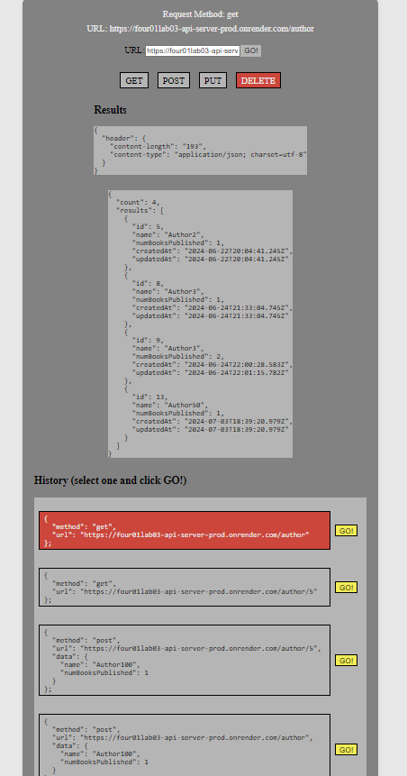

# 401 - Lab 29 - useReducer() Hook

## Project: RESTy

### Author: Melo

### Problem Domain

In phase 4, track every API call and store it in history.

### Feature Tasks & Requirements

The following user stories detail the major functionality for this phase of the project.

* As a user, I want to see a list of my previous API calls, so that I can see the results again, quickly.

Application Flow:

* User enters an API URL.
* Chooses a REST Method.
* Clicks the “Go” button.
* Application fetches data from the URL given, with the method specified.
* Application stores the API request and returned data into state.
  * Updates the list of previous API calls.
* Displays the response headers and results separately.
  * Both headers and results should be “pretty printed” JSON.

### Technical Requirements/Note  

1. Replace any component state managements to use derived state from useReducer() with a reducer function and initial state.

* \<App />: Use a reducer to store and manage all application state: loading, results, history.
  * Add to history array in state after every api call
    * method, url, results (json).

* \<History />: Iterates the history array in state and shows the previous API calls.
  * When one is clicked on, show the results in the results component.
    * Note: the results component renders whatever is in state.

### Componenet Hierarchy and Application Architecture

* index.js - Entry Point.

* \<App /> - Container.

        * Holds application state: The Request (from the form) and the Response (from the API).
        * Hook that can update state.
        * Renders 2 Child Components.

* \<Form />

        * Expects a function to be sent to it as a prop.
        * Renders a URL entry form.
        * A selection of REST methods to choose from (“get” should be the default).
            * The active selection should be displayed/styled differently than the others.

        * Renders a Textarea to allow the user to type in a JSON object for a POST or PUT request.
        * On submit:
            * Send the Form entries back to the \<App /> using the method sent down in props.
            * Form will run the API request.
                * Toggle the “loading” status before and after the request.

* \<Results />

        * Conditionally renders “Loading” or the data depending on the status of the request.
        * Renders the data as “pretty” JSON.

* \<History />

        Iterates the history array in state and shows the previous API calls.

        * When one is clicked on, show the results in the results component.
        * Note: the results component renders whatever is in state.

## Documentation

### How to initialize/run your application (where applicable)

* npm run dev

### Libraries needed (where applicable)

Install

* "axios": "^1.7.2",
* "react": "^18.2.0",
* "react-dom": "^18.2.0",
* "sass": "^1.77.5",
* "uuid": "^10.0.0"

Dev Dependencies

* "@testing-library/jest-dom": "^6.4.6",
* "@testing-library/react": "^16.0.0",
* "@testing-library/user-event": "^14.5.2",
* "@types/react": "^18.2.66",
* "@types/react-dom": "^18.2.22",
* "@vitejs/plugin-react": "^4.2.1",
* "eslint": "^8.57.0",
* "eslint-plugin-react": "^7.34.1",
* "eslint-plugin-react-hooks": "^4.6.0",
* "eslint-plugin-react-refresh": "^0.4.6",
* "jest": "^29.7.0",
* "jsdom": "^24.1.0",
* "vite": "^5.2.0",
* "vitest": "^1.6.0"

### React + Vite

This template provides a minimal setup to get React working in Vite with HMR and some ESLint rules.

Currently, two official plugins are available:

* [@vitejs/plugin-react](https://github.com/vitejs/vite-plugin-react/blob/main/packages/plugin-react/README.md) uses [Babel](https://babeljs.io/) for Fast Refresh
* [@vitejs/plugin-react-swc](https://github.com/vitejs/vite-plugin-react-swc) uses [SWC](https://swc.rs/) for Fast Refresh

### Testing

* App.jsx testing to assert CRUD method functionality
* Form.jsx testing to assert request info capture
* msw (mock server) used for testing

### Link to Pull Request ---> [Pull Request](https://github.com/MelodicXP/resty/pull/5)
