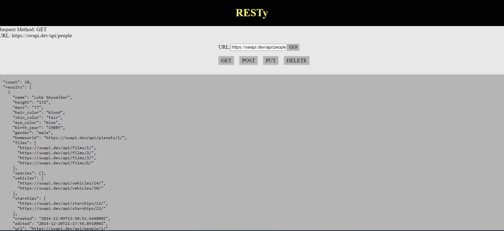

# 401 - Lab 26 - Component Based UI

## Project: Create a cloud version of the CAPS system

### Author: Melo

### Problem Domain

Begin the first of a 4-Phase build of the RESTy application, written in React. In this first phase, goal is to setup the basic scaffolding of the application, with intent being to add more functionality to the system as progression is made. This initial build sets up the file structure to progressively build application in a scalable manner.

### Feature Tasks & Requirements

Refactor RESTy application as follows:

1. Convert all child components of \<App /> from classes to functions.

    * The \<App /> component serves as the container for all sub-components of this application.
    * Leave this component as a Class.
    * Make sure all base styles for \<App /> are included in a .scss imported within the App.jsx file.
    * Ensure that the \<Header />, \<Footer />, \<Results /> and \<Form /> components are imported using ES6 import syntax.

2. Use .scss files to style each component.
    * Each of the components use their own .scss file for styling.

3. Core application functionality should remain unchanged.

    * The \<Form /> component should:
        * Call a function onSubmit() that updates the \<App /> component via a function sent down as a prop so that the app can process the form values.
    * The \<Results /> component should show mock API results.

## Documentation

### How to initialize/run your application (where applicable)

* npm run dev

### Libraries needed (where applicable)

Install

* "axios": "^1.7.2",
* "react": "^18.2.0",
* "react-dom": "^18.2.0",
* "sass": "^1.77.5",
* "uuid": "^10.0.0"

### React + Vite

This template provides a minimal setup to get React working in Vite with HMR and some ESLint rules.

Currently, two official plugins are available:

* [@vitejs/plugin-react](https://github.com/vitejs/vite-plugin-react/blob/main/packages/plugin-react/README.md) uses [Babel](https://babeljs.io/) for Fast Refresh
* [@vitejs/plugin-react-swc](https://github.com/vitejs/vite-plugin-react-swc) uses [SWC](https://swc.rs/) for Fast Refresh

### Testing

Not required for this lab

### Link to Pull Request ---> [Pull Request](https://github.com/MelodicXP/resty/pull/2)
